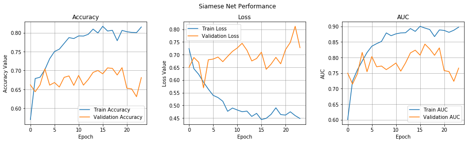

# Automatic-kinship-detection
This is a kaggle Challenge. Given a pair of images of 2 faces we have to determine whether they are related or not. Here I have used a Siamese network over VGG-facenet to tackle this problem.

[Fork the solution notebook in Colab](https://colab.research.google.com/drive/1sPaawdP75srFpI2sVi3RqJzp1F4KgtYj)

## Problem
To build a more complex model by determining if two people are blood-related based solely on images of their faces. Not every individual in a family shares a kinship relationship. For example, a mother and father are kin to their children, but not to each other. Below is the example of kinship where person in a specific row are related.

## Solution
Here I have used a siamese architecture which is built using VGG-Face resnet. Loss used is binary_crossentropy. Optimizer is Adam. My latest submission scored around 0.792. Training and Validaiton metrics of Trained model are given below.

## Architecture Diagram

## Authors
* Aditya Jain : [Portfolio](https://adityajain.me)

## Licence
This project is licensed under the MIT License - see the [LICENSE.md](https://github.com/adityajn105/Automatic-kinship-detection/blob/master/LICENSE) file for details

## Must Read
1. [Triplet Loss](https://omoindrot.github.io/triplet-loss)
